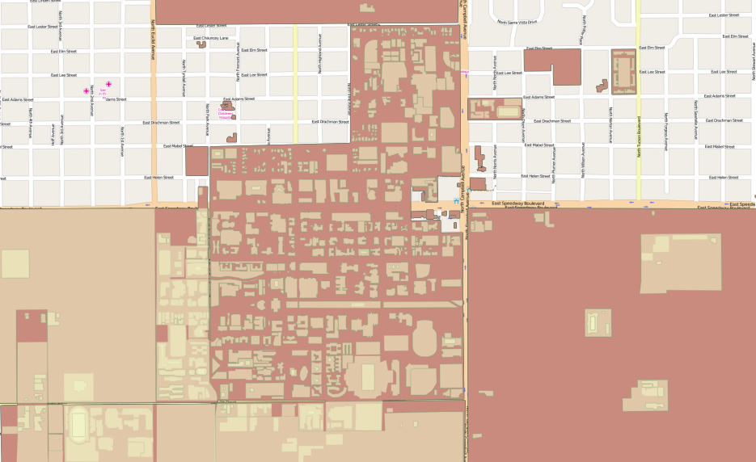
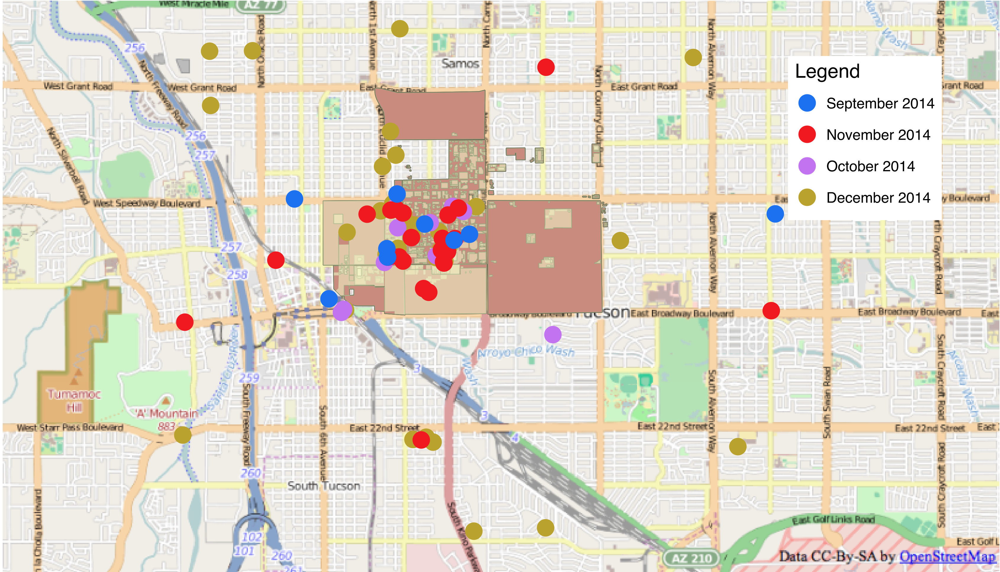

# Twitter data mining for disease mapping
Twitter data mining project for for mapping flu spread in University of Arizona campus 

# Report

A link to the report : https://github.com/amit4111989/twitter_data_mining_disease_mapping/tree/master/report%20(pdf%20and%20doc)

# Results

Data was mined from Oct 2014 - Dec 2014

# Technology Used

Tweepy Python api (http://www.tweepy.org/)

# Disclaimer

This is an individual study for a class project. The results shown here are not certified and are purely experimental.
